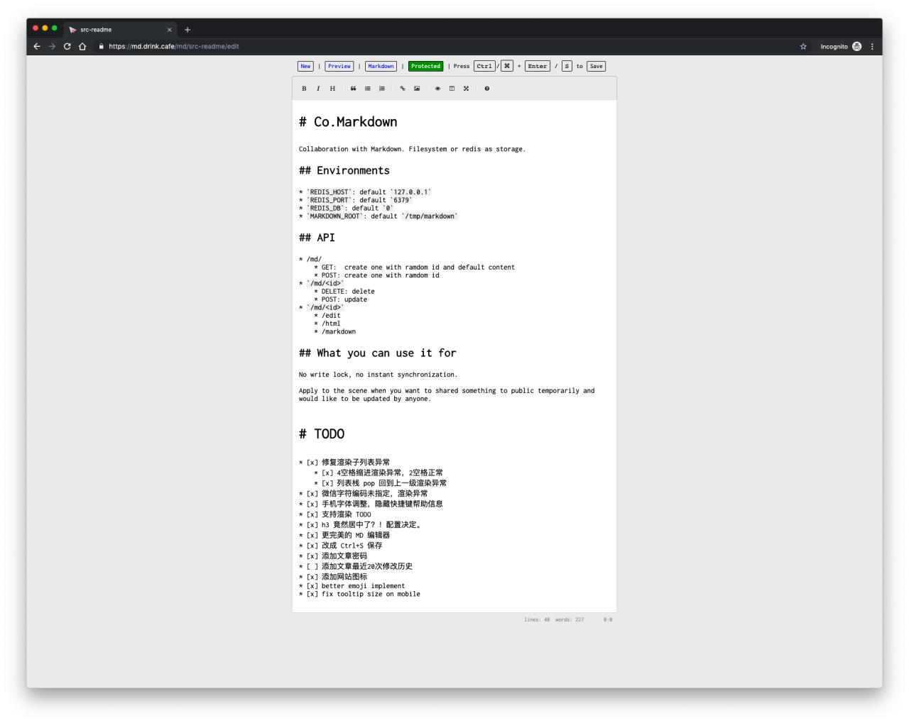

# Co.Markdown

Collaboration with Markdown. Filesystem or redis as storage.

## Environments

* `REDIS_HOST`: default `127.0.0.1`
* `REDIS_PORT`: default `6379`
* `REDIS_DB`: default `0`
* `MARKDOWN_ROOT`: default `/tmp/markdown`

## API

* `/md/`
    * GET:  create one with ramdom id and default content
    * POST: create one with ramdom id
* `/md/<id>`
    * DELETE: delete
    * POST: update
* `/md/<id>/set_password`
    * POST: update or set password
* `/md/<id>`
    * /edit
    * /html
    * /markdown
* `/render`
    * POST: render the markdown you posted

## What you can use it for

No instant synchronization.

Apply to the scene when you want to shared something to public temporarily,
and would like to be updated by someone has the password if you have set.

## TODO

* [x] 修复渲染子列表异常
    * [x] 4空格缩进渲染异常，2空格正常
    * [x] 列表栈 pop 回到上一级渲染异常
* [x] 微信字符编码未指定，渲染异常
* [x] 手机字体调整，隐藏快捷键帮助信息
* [x] 支持渲染 TODO
* [x] h3 竟然居中了？！配置决定。
* [x] 更完美的 MD 编辑器
* [x] 改成 Ctrl+S 保存
* [x] 添加文章密码 （Basic Auth)
    * [x] 在浏览器为不同文章分别保存密码
* [ ] 添加文章最近20次修改历史
* [x] 添加网站图标
* [x] better emoji implement
* [x] fix tooltip size on mobile

## Screenshot

